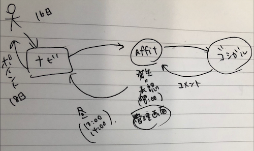
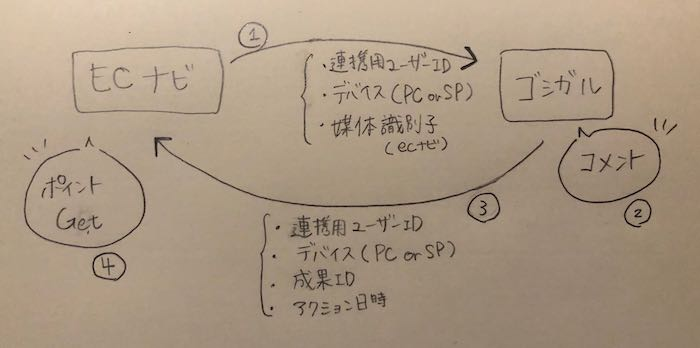
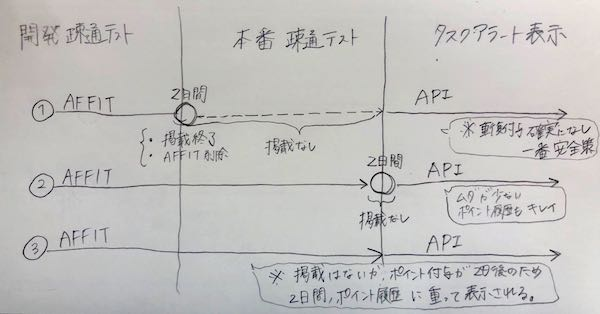

# 技術力評価会 評価対象情報

* 日時
	* 2019年11月8日(金) 15:00-
* 被評価者
	* VM 小林彩花 
* 評価者(敬称略)
	* 井手上 雅迪
	* 大島 一将

## 現在のグレード

E1

## 概要
ゴシップガールズトークとECナビのAPI連携＆ナビのトップに誘導を表示

参考： [チケット](https://adingo-redmine.sjdc.voyage/issues/67340)、[issue](https://github.com/voyagegroup/ecnavi/issues/8165)

## 評価してほしいポイント

- データの量・保存期間を考えてDBを圧迫しないように対応した
- AFFIT経由とAPIでのポイント付与が重なり複雑化しないようにリリーススケジュールを考えた

## 前提
- [ECナビ](https://a-kobayashi.ecnavi.jp.dev.ecnavi.org/) … ポイントサイト(VM運営)
	- 全体MAUの平均約45万人(2018/7-2019/10)

- [ゴシップガールズトーク(ゴシガル)](https://gg-talk.jp/?lp=ecn_pt) … "女子専用のトークルームサービス"（fluct運営）

　　※ ECナビとゴシガルは既に提携している。　原価率50%（ユーザーのポイント取得分と同額利益になる）

## やりたいこと

- ゴシガルの露出を増やし、CVを増やしたい。
- AFFITではない方法でゴシガルとナビの連携をしたい

## 当時の状況

ユーザーの動き：
案件画面より、ECナビからゴシガルに飛び、ゴシガルでコメント。数日後にポイント付与される。

#### ECナビの課題

以前、ゴシガルに関するポイント付与は、AFFITというASPを利用しCVの計測・ポイント付与をしていた。  
AFFITはファイル連携式のため、翌日に承認、更にその翌日にバッチでファイル取得、それを元にポイント付与を行っていた。  
そのため、発生（ユーザーがゴシガルにコメント）してからポイント付与されるまで数日を要した。

提携当時はなるべくECナビ側でのコストを抑えるためにすでにある機能で実現できそう、ということでAFFITを使って無理やり繋いだが、そもそもAFFITは定額用のASPである為、ゴシガルがサービス利用履歴に載ってしまっていた。  
ゴシガルは定額じゃないのでサービス利用履歴には載せたくない、且つ、キャンペーンの一部で達成条件がすぐにクリアできてしまうデメリットがあった。   ( [例](https://ecnavi.jp/contents/pex_welkatsu/) )  

#### ゴシガルの課題

ゴシガルのサービス自体、暫く続けていくことになった。
そのため、もっと露出を増やしてCVを上げたい。

#### ユーザーの課題

AFFIT経由だと広告面での掲載（[例](https://ecnavi.jp/pointboard/detail/?id=qBQ2Xv9C&FR=131)）となったが、検索しないとゴシガル案件が出てこなかった為、分かりづらかった。

## やること

- PC・SPともに広告面での掲載を終了し、毎日貯まる（タスクアラート※）に表示するようにする
- ゴシガルとECナビをAFFITを使わない方法でリアルタイムポイント付与する

どちらも満たすためにAPI連携※を行った。
  
  
※ 毎日貯まる（タスクアラート）とは  
赤丸のバッチが、即時で残回数を表示しているため、リアルタイム付与の案件である必要がある。
<kbd>

※ API連携 イメージ  

## プロジェクトの進め方

### チーム
*  メンバー
	* ECナビ
		* 小林 彩花（実装）
   		* 三井 千佳（実装支援）
   		* 安藤 敦（責任者）
	* fluct
		* 中川 慶悟（連携担当）

* slack： [#ゴシガルトーク_ecnavi](https://voyagegroup.slack.com/archives/CH8SS476U/p1563438284004800) 

### やったこと

* タスク洗い出し
	* 安藤さん、三井さんとキックオフMTG (7/16)　[チケット](https://adingo-redmine.sjdc.voyage/issues/67340)
   * [GitHub issue](https://github.com/voyagegroup/ecnavi/issues/8165)にタスクを書き出し、チームで確認
   * 中川さん、三井さんと事前にMTG 
	   * API仕様、テスト方法、リクエスト回数やエラー時の再送等
	   * 気をつけたこと
		   * 伝えたい・話し合いたいことは事前にアジェンダとしてリストアップしておき、一つ一つ確認するようにした。

* **成果履歴を保存するテーブル作成** ( [PR](https://github.com/voyagegroup/ecnavi-db/pull/437) )
	* [他のタスクアラート案件を元に、CV数の見積もりをした。](https://github.com/voyagegroup/ecnavi/issues/8165#issuecomment-513127311)
		* パーティションをきるようにした
			* 毎月約100万強〜300万弱くる想定だった。
			* MYSQLでは保持件数が10,000,000レコードのオーダーを超えるような場合パーティショニング化を検討する。（ナビルール）
			* ゴシガルとの提携が終わるまでレコードは増え続けるので、パーティショニング化することにした。  
			* 1ヶ月毎にパーティションを切るようにした。  
				* レコード数としては許容できる範囲。
				* 1ヶ月毎に成果を計上してるので、区切りよく、無理もない。
		* データはRedshiftに定期的に移行するようにした。
			* Redshiftの容量が問題ないことを確認・サービスGに共有
		* MYSQLのデータは3ヶ月で定期削除するようにした
			* 移行が失敗した場合したときのために数カ月分は置いておきたい
			* そこまで沢山バックアップは必要ないので3ヶ月で調整

* **APIの実装** ( [PR](https://github.com/voyagegroup/ecnavi/pull/8227) )
	* エラーハンドリング
		* ログの出力について、どこで、どのレベルのログを出すか。[参考](https://github.com/voyagegroup/ecnavi/pull/8227#discussion_r309045442) 
		* すぐに対処したい、通知したいものはあえてExceptionをcatchしない [参考](https://github.com/voyagegroup/ecnavi/blob/dbb52f0dec1e76661005527c2373e57dee793083/sites/ecnavi/apps/controller/api/GgtalkController.php#L55)
	* テストを漏れがないように色んなケースを想定して書いた
		* エラー時のログは分かりやすいようにだし、専用の例外を切る
		* すぐに気付きたいエラー時はSlack通知されるようにする
			* 例：パラメータがおかしいとき。仕様の変更の可能性がある
			* phpfatalをdatadogで検知し、Slackに流す。

		* 結果
			* 開発テスト、本番テストともに問題なくリリースできた。
			* 運用開始後、パラメータがおかしい際等Slack通知が正常に出来ている。

* Redshiftへの移行処理 （流し見でOKです）
	* etl ( [PR](https://github.com/voyagegroup/ecnavi-etl/pull/296) )
	* dwh ( [PR](https://github.com/voyagegroup/ecnavi-dwh/pull/200) )

* ゴシガルからのアクセス許可設定（流し見でOKです）
	* アクセスポイント開通 ( [PR](https://github.com/voyagegroup/ecnavi-aws-cloudformation/pull/1661) )
	* APIのアクセス制限・開発( [PR](https://github.com/voyagegroup/ecnavi-provisioning/pull/356) )
	* APIのアクセス制限・本番 ( [PR](https://github.com/voyagegroup/ecnavi-provisioning/pull/357) )
	* 後片付けでアクセスポイントを閉じる・開発 ( [PR](https://github.com/voyagegroup/ecnavi-aws-cloudformation/pull/1717) )

* 安藤さんと三井さんと再度最終確認MTG
	* リリースタイミングを考えた  
		* AFFIT経由の付与形式
			* コメント後、翌日に承認される。この時点で「サービス利用履歴」にのる（←載せたくない）
			* 成果通知方法がファイル取得形式なので、更にその翌日にバッチで成果取得し、ポイント付与が実行される。
			* ポイント付与後、「ポイント履歴」にのる
			* 最短でも計2日かかる
		* APIでの付与形式
			* リアルタイム付与
			* コメントした瞬間ゴシガルからナビのAPIに通知が来てポイント付与される。
			* それと同時に「ポイント履歴」にのり、「サービス利用履歴」には乗らない。

　　  
	　　一番損が少なく、安全である②の方法を選んだ。

* 中川さんと三井さんと再度最終確認MTG
	* API仕様
	* リリースタイミング共有
	* 想定CV数
	
* 中川さんと連携しながら、開発でのAPI疎通テスト確認

	* 確認項目
		* 正しくポイント付与できる（各デバイス4回まで）
		* エラー時の挙動（不正パラメータ）
		* ECナビのポイント履歴画面に出る

* 中川さんと連携しながら、本番でのAPI疎通テスト確認  
　　※ 確認項目は同上  
　　※ この時点ではゴシガルへの誘導はECナビ上にない。  
* 毎日貯まる（タスクアラート）に出す( [PR](https://github.com/voyagegroup/ecnavi/pull/8418) )  
	* 8/29　初回リリース
	* 9/2　以降安定稼働

## 結果

- ### ゴシガルCV数

	- 6月 62,436件
	- 7月 55,465件
	- 8月 51,083件　（AFFIT付与,API付与 合計）
		- 【SP】42,174件
		- 【PC】7,774件　
		- 【API付与　両デバイス分】1,135件  
	
	　　〜以降API付与のみ〜  
	
	- 9月 1,841,094件

  　 **CV数約30倍**になった。

- ### ECナビ売上
	- 6月
		- 【合計付与数】187,308pts.
		- 【請求額】37,461円(187,308pts.×2×0.1円)

	- 7月
		- 【合計】166,395pts.
		- 【請求額】33,279円(166,395pts.×2×0.1円)

	- 8月
		- 【ポイント合計】153,249pts.
		- 【請求金額】30,649円(153,249×2×0.1円)

	
	　　〜API開始〜
	
	- 9月 
		- 【SP】2,709,945pts.
		- 【PC】2,813,337pts.
		- 【請求金額】1,104,656円 (合計 5,523,282pts.×2×0.1=1,104,656円)

       ※ 1pts. = 0.1円  

　　　 **売上約30倍**になった。

- ### ユーザー  

   - ブログ等で取り上げられ、毎日できる美味しい案件として認識が広まっていそう。（ [例](https://trendsn3n.info/2019/09/08/ecnavi-gosigal/) ）
