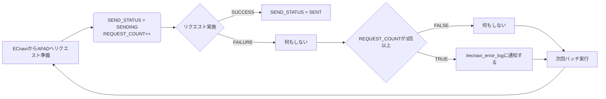

# インフルエンサーへの成果通知画面の為のシステム開発をやって奔走した話

- 開催日
  - 10月 25日 (水曜日)⋅午後15:00～17:00
- 評価者
  - 南大津 寛さん
  - 畑 香奈江さん
- 評価対象者
  - 小林 彩花
  - 所属
    - 株式会社DIGITALIO ポイントメディア事業本部
  - グレード
    - E2

## 概要
- チームの目標として、アフィリエイトの粗利を最大化しようとしている。その方法として発生件数を最大化する方針である
- 今までアプローチしていなかった（非ポイ界隈の）インフルエンサーを獲得する方針で動いている施策がある
  - インフルエンサーに案件を紹介してもらうことによって、発生件数を倍々にしたく、インフルエンサーを囲い込みたい
- だが、インフルエンサーを囲い込むには課題が2つあって難しい状態であり、それを解消する方法として、インフルエンサーへ管理画面を提供できるように開発を行った
- 開発が完了したのでインフルエンサーを囲い込む土壌ができたが、まだ始まったばかりなので結果はでていない

## 用語

- ECナビ
  - https://ecnavi.jp/
  - アフィリエイトなどでポイントを貯めることが出来るサービス。貯めたポイントはPeXへ交換し各種ギフト券などへ交換可能。
- デジコ
  - https://digi-co.net/
  - paypayなどに交換することができるデジタルギフトサービス
- デジコキャンペーン
  - 実例: https://ecnavi.jp/digico_campaign/bankacademy_olive/
  - ECナビに会員登録しなくても、メールアドレスを入力するだけでCV完了したらデジコを獲得できるキャンペーン
- PM
  - 「ポイントメディア」の略語
- CV
  - 「コンバージョン」の略語
- 成果
  - 発生, 承認, 否認のステータスがある。
  - CVすると「発生」になり、広告主が「承認/否認」を確定することで、媒体に成果通知が送られるなどする。
- 非ポイ
  - ポイント活動界隈外の人々のこと。
  - どこのポイントサイトも手を出せていないブルーオーシャン
    - そもそも「ポイントサイトの理解」「ECナビ会員登録」などをしてもらう必要があり、会員獲得やCVの難易度が高い 
- AFAD
  - https://markecats.co.jp/affiliatead2/
  - 株式会社マルジュが運営するASP
- IF（参考資料内にでてくるので記載）
  - 「インフルエンサー」の略語
  - PMでは案件をインフルエンサーに紹介して貰って、発生件数を伸ばす施策を行っている

## 体制

### 所属チーム
チーム体制 | 要はこういう事 | 全体感
-- | -- | -- 
affiliate_unit(営業・運用) 　- [user_team](https://app.slack.com/client/T024G4NMH/browse-user-groups/user_groups/SGSM8HU6B) 　　- 今回はこちらのチームで進めている施策 　- [asp_team](https://app.slack.com/client/T024G4NMH/browse-user-groups/user_groups/SGT2GRZQE)   tech_unit(開発) 　= [@g_pm_engineer_t](https://app.slack.com/client/T024G4NMH/browse-user-groups/user_groups/SHM81K867) 　　- メディア事業本部全エンジニアが所属しているチーム 　- [@pm_affi_unit_eng](https://app.slack.com/client/T024G4NMH/browse-user-groups/user_groups/S05EV29B695) 　　　- affiliate_unitに専属でつくことになったメンバー 　　　　- ayaka 　　　　- fuji 　　　　- guri 　　　　- arechan | <kbd></kbd> | 

- AFFI_UNIT
  - 粗利: 4000万/月
  - これは、PMの中で一番大きい
    - PMの粗利
      - 1位. 成果関連: 4000万(←ｺｺ！)
      - 2位. リサーチ関連粗利2000万 
      - 3位. ADNWとPeX失効益で1000万ずつ
      - 5位以下. 100万, 200万規模

このため、所属しているチームの粗利貢献度はかなり高い。

### PJメンバー
- メイン
  - 古堅 愛己さん
    - 非ポイインフルエンサー施策の発案者
    - 一緒にマルジュとのMTGに出てくださった
    - 仕様やスケジュールの確認を共通認識で行った
  - 小林 彩花(自分)
    - 株式会社マルジュとのやり取りを行い、仕様を確定させていった
    - 設計を行った
    - 後述の実装を行った
    - どのようにAFADの管理画面を扱うか、運用さんに説明会を行った
- その他
  - 大石ルミさん
    - 株式会社マルジュとの最初のMTGを繋いでもらった。
  - 田雁泰賀さん
    - 連携が始まってから実際の作業を行っている。 
  - @pm_affi_unit_eng
    - 設計や実装のレビューをしてもらった。

## 背景

 - ECナビはポイントサイトであり、ポイントを貯めるための方法としてアフィリエイトがある
    - ポイントサイトの会員が広告主の条件を満たすことで、ポイントサイトには売上があがる＆ポイントサイトの会員はポイントを貰えるビジネスモデルである
 - 自分が所属しているチームはこのアフィリエイトの収益を最大化することが目標であり、件数×単価が収益となるが現在は件数を最大化するという方針である
 - 非ポイント活動界隈は、他社も踏み入れられていないブルーオーシャンであり、是非その界隈からも発生件数を獲得したい狙いがある
 - その為に、ECナビの非会員でもアフィリエイトをやってもらえるキャンペーンの機能が作成されており、現在「デジコキャンペーン」が稼働している
   - 非会員のためポイントは付与できないため、インセンティブとして[デジコ](https://digi-co.net/)を渡す。
 - デジコキャンペーンは提携しているインフルエンサーを通して告知しているため、面を広げるためにはたくさんのインフルエンサーを囲い込みたい（インフルエンサーは紹介したユーザーがアフィリエイトをやってくれるとインフルエンサーにも収益が上がるようになっている）
 - 最初は提携が5人からスタートし、現在は20人程度提携している
   - が、以下のような課題があった
     - 課題1.  インフルエンサーへDMで直接やり取りを行うのでECナビへの信頼関係が既に構築されているなどしないと契約したいと思ってもらえない
     - 課題2.  インフルエンサーを増やすごとに作業コストが増える状況なので、ECナビ的にもキャパシティがないためインフルエンサーを積極的に増やせない
 - 上記の状況を改善できるような機能開発を行った

## 評価してほしいポイント

- 限られた時間内でECナビの資産を利用し、ミニマムに作成・運用開始できた
- DB設計を既存と孤立化させ、新しい概念を表現した(ECナビユーザ以外の成果)
- 自動リカバリができる且つ、何度も失敗したら気付ける上に、簡単にリカバリできるバッチの仕組みを作った
- 自ら動いてリードを取りながら、周りも巻き込んで動いた

## スケジュール

- 2023/8 上旬: キックオフ
- 2023/8 中旬: 成果取り込みの要件決定
- 2023/8 下旬: DB設計・作成
- 2023/9 上旬: 成果通知の要件ざっくり決定
- 2023/9 中旬: 成果取り込み部分リリース
- 2023/9 下旬: セッションID保存部分リリース
- 2023/10 上旬: 成果通知部分リリース

## 制作物
- メインissue
  - https://github.com/voyagegroup/ecnavi/issues/16406
- ER図など
  - https://cacoo.com/diagrams/jer2dK6PO4eZgIub/9BAE9

### 全体の流れ
- 通常のアフィリエイトは、ユーザはECナビ→ASP→広告主の順でリダイレクトし、CVされたらその逆の順で成果通知が送られる。
- そもそもやりたいこととしては、インフルエンサーに対して成果状況を見れるようなものを提供したいという要望がある
- そのために、ECナビを広告主に見立てて、インフルエンサーとECナビの間にAFADというASPをたてることでコストを削減しつつ実現をした。
  - 理由: 一からインフルエンサーに提供できる管理画面を作ることは、AFADを利用する場合と比べてコストが高いと判断した。
  - AFADはECナビで既にメディア、広告主側として利用しており連携が強い会社だった。

before  
<kbd></kbd>

after  
<kbd></kbd>

### DB設計

- ①AFADからナビへリダイレクトする箇所
  - AFADの発行したアフィリンクを踏むと、ECナビのキャンペーンページに飛ぶ
    - 例: https://tag.ecnavi-tracking.jp/cl/3b2d5h7d
  - その際に付与されるセッションIDと呼称してるパラメータを、AFADに成果通知する際にECナビは返さなくてはならない
  - そのため、セッションIDをクリックごとに保存されるテーブルに格納できるように修正を行った
- ②ASPからナビへ成果通知をする箇所
  - 広告主→ASP→ECナビへ返ってくる時、ユーザIDとして扱われる値は `digicocpXXXXX` のような形式になっている。
  - 既存では、ECナビ会員ではないためユーザ解決ができず、スキップするようにしていた。
  - それを、新しく成果テーブルを作ることでナビのアフィリエイト成果とは別の、デジコキャンペーンの成果として保存できるように改修した。
- ③ナビからAFADへ成果通知をする箇所
  - ナビ→AFADへ成果通知を送れる仕組みは既存ではないため、一から作成した。
  - なるべく早く実施したいという要望があったため、既にECナビにあるバッチシステムにのっかり実装した。
<kbd></kbd>

#### ①AFADからナビへリダイレクトする箇所
DB設計で言う、`DIGICO_CAMPAIGN_UNIQUE_KEY`に`SESSION_ID`カラムを追加した。  
要するに、デジコキャンペーンでの遷移情報を保存するテーブルに、AFADから渡ってくるセッションIDを保存するようにした。  

PR一覧(見なくて良い)

- [web][sessionIdをデジコキャンペーンで登録できるようにする#16781](https://github.com/voyagegroup/ecnavi/pull/16781)
- [web][デジコキャンペーンで'ses'が渡ってこなくてもいいように修正 #16825](https://github.com/voyagegroup/ecnavi/pull/16825)
- [mysql][デジコキャンペーンの情報にインフルエンサー経由の情報をもたせる #1027](https://github.com/voyagegroup/ecnavi-db/pull/1027)
- [mysql][デジコキャンペーンでSESSION_IDが渡ってこなくてもいいように修正 #1029](https://github.com/voyagegroup/ecnavi-db/pull/1029)
- [dwh][alter table digico_campaign_unique_key #601](https://github.com/voyagegroup/ecnavi-dwh/pull/601)
- [dwh][nz_digico_campaign_unique_key.session_idのnot null制約を外す #602](https://github.com/voyagegroup/ecnavi-dwh/pull/602)

#### ②ASPからナビへ成果通知をする箇所

既存ではデジコキャンペーンの成果は弾いており、システム的にどこにもデータがなかった。    
そのためECナビ側での承認作業は各ASPの管理画面を見て承認作業を行っていた。    

リリースは利用案件が多いASPからミニマムに実装し、良さそうであれば連携方式が汎用化に載ったASP一覧に手を広げてリリースした。  
参考: [デジコキャンペーンできるASPを整理](https://docs.google.com/spreadsheets/d/1CjE9VYVS5-kZuIs1fi_OHP5sf-7GRbAnyrEPcDVTNbY/edit#gid=2069147576)

現状もデジコキャンペーンが利用可能だが、未だ成果取り込みができてないASPがあるが、追って対応をしている。  
先に全部成果取り込みを終えるより、限られたASPでも案件が多ければ問題ないと判断し、コア機能の実装完了を優先した。  
また、諸事情により案件が止まっているのでクリティカルな問題にはなっていない。  

PR一覧(そこまで見なくて良い)

- [web][成果ログにinsertするClass作成 #16652](https://github.com/voyagegroup/ecnavi/pull/16652)
- [web][非ポイインフルエンサー用管理画面で扱う成果テーブル群のDao作成 #16651](https://github.com/voyagegroup/ecnavi/pull/16651) 
  - 上記2つは、PRが大きくなりそうだったのでなるべく細かく切ることを意識した結果の産物。
- [web][Janetの成果をログに取り込む#16684](https://github.com/voyagegroup/ecnavi/pull/16684)
- [web][汎用系Push型の成果取り込み対応 #16666](https://github.com/voyagegroup/ecnavi/pull/16666)
- [mysql][デジコ成果テーブル作成 #1021](https://github.com/voyagegroup/ecnavi-db/pull/1021)

#### ③ナビからAFADへ成果通知をする箇所

AFADへの仕様の確認を、先方とのMTGやCARTA内でのマルジュ専用のprivateチャンネルにて直接やり取りを行い、細かい箇所の確認などを進めていった。  

処理の流れは以下

このようにした理由
- 先方から返ってくるエラーがStatusCodeしかないかった
- この成果通知バッチはAFADに成果を反映するものであり、インフルエンサーが見れるタイミングが遅れるだけで、クリティカルな問題にはならないと判断した
- そのため、閾値を設定して、都度エラーログに都度出す必要はないと判断
- 閾値を3にして、リクエストが3回以上失敗したらエラーログに通知し確認するようにした。

同じ成果を送った場合の挙動確認などは文面で行い、魚拓を得た。  
<kbd></kbd>　  
ここにこだわった理由  
- こちら側で送るのが失敗した理由が分からないため(requestに失敗したのか、statusをDBに保存するのに失敗したのか)、重複として扱われなければ照会APIなどの実装を依頼する必要があった。

PR一覧(見てほしい)

- [デジコキャンペーンの成果をAFADに成果通知するバッチ作成 #1287](https://github.com/voyagegroup/ecnavi-batch/pull/1287)
- [デジコキャンペーンの成果通知でretryできるようにする #1304](https://github.com/voyagegroup/ecnavi-batch/pull/1304)

## 結果・今後の展望

非ポイの施策が始まり、発生も出ている状態。    
インフルエンサーの提携も増やせており、今後100を超えるインフルエンサーと提携する予定で、提携インフルエンサーは拡大して行けている。    

また、汎用化されたキャンペーンを登録さえしておけば、後はインフルエンサーが勝手に掲載してもらえる状況を作ることが出来た。  
これによってインフルエンサーの拡大もしやすくなった。

試算としては、インフルエンサーが1案件紹介して発生したCV数は少なくて10件、多くて100件。  
10件✕100人 = 1000件  
粗利1件あたり1000円✕1000件 = 100万/月行く想定  
インフルエンサーが増えれば増えるほど粗利が増えていく仕組みが作れた。  
[参考](https://github.com/voyagegroup/ecnavi/issues/16581#issuecomment-1759185025)

- 発生粗利インパクト  
  - 1件あたり粗利1,000円想定  
  - 10月：1,000円×1,000件 = 100万/月  
  - 11月：1,000円×1,500件 = 150万/月  
  - 12月：1,000円×2,000件 = 200万/月    

さらに、今まではポイ活界隈だと還元勝負になっていた。  
ポイ活界隈では還元率が高いポイントサイトにユーザが流れるので、還元率を1位にするために粗利を削る必要があって辛かった。  
非ポイ活界隈では、ポイ活してないターゲット層なので、還元率や額にこだわらないユーザが多く、還元率で戦わない世界を作れた。  
=> 新たな仕組みが作れたのはめちゃくちゃいいこと。(他社もまだ介入できてない!)

