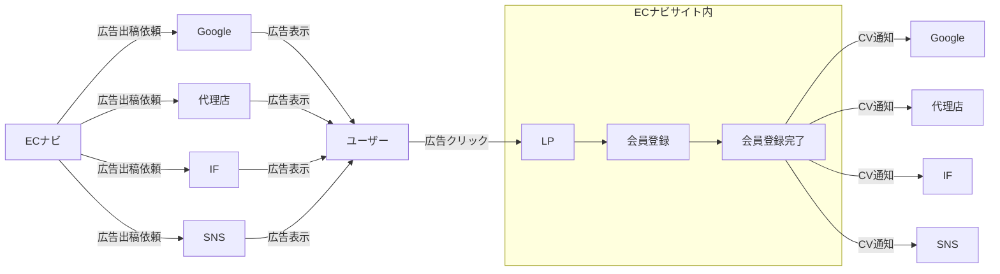
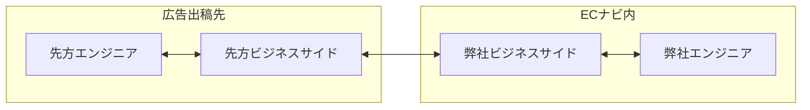
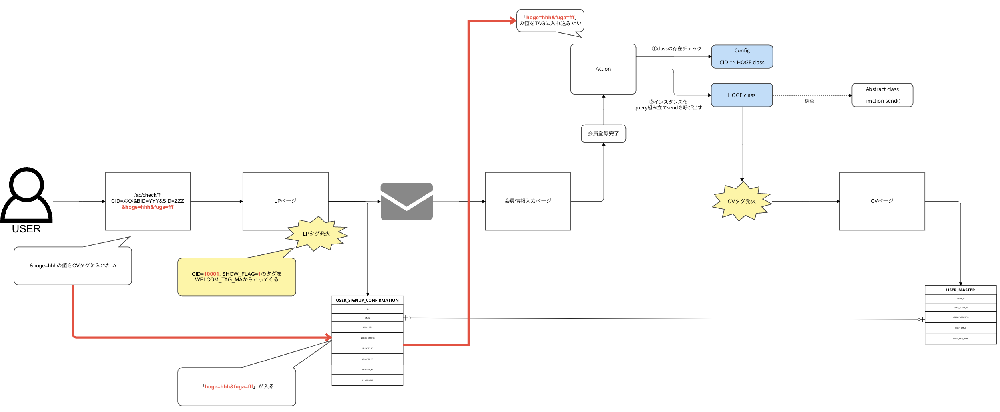
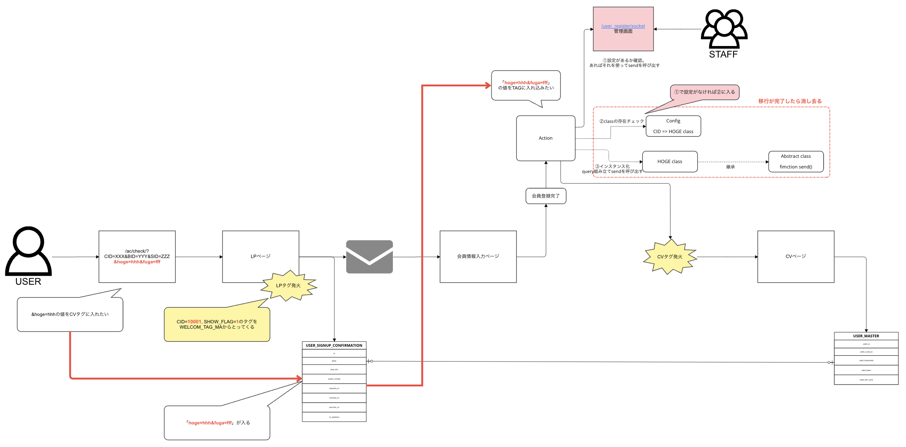
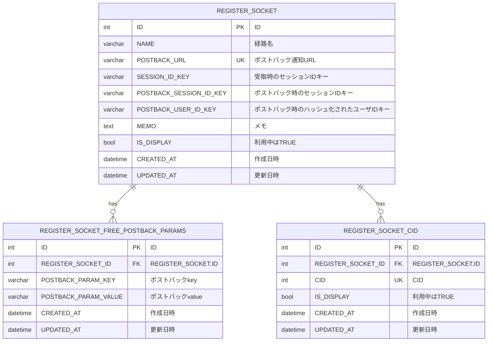

# 広告出稿の繋ぎこみ作業を管理画面化し、エンジニア工数を0にした話

----

## 執筆者
- 評価対象者、所属、グレード
  - 小林彩花(あやか) 
  - 株式会社DIGITALIO メディア事業本部 TechUnit Affiliateチーム
  - E2
- 執筆時期
  - 2023/05
 
## 前回の技術力評価会資料

https://github.com/voyagegroup/tech-assessment_2023/tree/main/2023-2nd-half/digitalio_a-kobayashi

## 概要

- ECナビの広告出稿先との連携のたびにコードを書く必要があったため、管理画面化した。
- それにより、いままでエンジニア工数がかかっていたのを0にし、ビジネスサイドの作業のみで、連携が可能な状態にした。
- かつそれを行うまでにおいて、既存のシステムに自ら疑問を持ち、改善の提案、ビジネスサイドとの工数確保の合意、要件定義、実装までを行った。

## 用語

用語| 意味
---|---
ECナビ|https://ecnavi.jp/ アフィリエイトなどでポイントを貯めることが出来るサービス。 貯めたポイントはPeXへ交換し各種ギフト券などへ交換可能。 今年20周年！！
ソケット連携 | ECナビの広告出稿の繋こみ方法の一つ。 ECナビの会員登録が完了したら、サーバーサイドから連携先に成果通知をポストバックする方法。
タグ連携 | ECナビの広告出稿の繋こみ方法の一つ。 ECナビの会員登録が完了したら、会員完了ページに埋め込んだscriptなどで発火させて連携先に成果通知をポストバックする方法。
CID | Client IDの略(言い伝えによる)。 どの経路からの会員登録かを識別するためのID。 広告出稿の連携先には、CID付き新規会員登録リンクを渡し、そこにユーザを遷移させてもらう。 ECナビでは特定のCIDの経路からの流入がどのくらい多いかを分析する際等に使用している。
TechUnit | [hitonowa組織図](https://hitonowa.work/carta/organization/team/1430) メディア事業本部内のエンジニア全員が所属するUnit。各Unitに対してチームとして専属でついたりする。 筆者はAffiUnitにつく、Affiliateチームのリーダーを担当する。
AffiUnit | [hitonowa組織図](https://hitonowa.work/carta/organization/team/1427) ASPとのやり取りを始めとした掲載商材や成果管理、また、新規会員登録やプロモーションを主に行うUnit。

> [!TIP]  
> [ソケット連携とタグ連携の違いの図示](https://github.com/voyagegroup/ecnavi/issues/14900#issuecomment-1305106408)

### 今回関わったメンバー
開発メンバー
  - 小林彩花

レビュー
  - TechUnit
    - 小栗 大輝(Affiliateチーム): ぐり
    - 藤井 渉(Affiliateチーム): ふじ
    - 佐々木 俊充: 俊充さん
    - 中村 朋臣: おみさん

ビジネスサイド
  - 尾田依子: 尾田さん
    - ECナビの広告出稿など、プロモーション全領域の数値責任者。
    - 基本的に広告出稿との繋ぎこみや対応依頼は尾田さんからの依頼。
    - 画面構成などの、管理画面仕様の相談をした。
  - 須藤美月: みじゅ
    - チーム内で様々な仕事を受け持ち、広告出稿にも関わっていた。
    - 画面構成などの、管理画面仕様の相談をした。

AFFI Unit
  - 案件調整に私が上げた今回の「ソケット連携管理画面化」の課題について話し合った。
  - 工数を割いて取り組むという判断も、案件調整の場において、米村さんを始めとするAFFI UNIT全体で行った。

## 背景
### 広告出稿について
- ECナビでは、様々な媒体、代理店等に広告出稿の依頼をしている。  
- 出稿にあたって、CV = 会員登録完了 とし、広告出稿先に成果通知をする必要がある。  
- そのため、広告出稿先との連携作業を行う必要がある。

※図の例では例として4つを広告出稿先として挙げているが、他にも様々な出稿先がある。

### 連携作業について
- 広告出稿には、ソケット連携とタグ連携の2つの方法がある。
- タグ連携は、既に管理画面が存在しており、そちらで運用さんが自分で設定できる状態になっている。(当日[管理画面](https://ecnavi-admin.ecnavi.me/ad_effectiveness/cid/)を見せる)
- ソケット連携は、エンジニアが対応する必要があり、レビューを含めて工数2日程度かかっていた。
- 広告出稿の繋ぎこみは、頻度がまちまちで、来る時は緊急度合いが高い事が多かった。
- 差し込みでやってください、が多いため、工数は少ないがコンテキストスイッチが多かったり、リソースが本当に無いときなど困る状況になっていた。
- また、エンジニアが対応する必要があるため、運用さん側でスケジュールのコントロールがしづらく、出稿開始に間に合わないこともあった。

### システムの負債について
- 繋こみの際にconfigに一行追加&Class1ファイル追加の作業が思考停止で行われていて、コードも冗長になっていた。
- 広告出稿が終了している連携先があっても消されることがなく、負債が溜まっていっている状況だった。

### チームの課題について
- 連携作業において、ビジネスサイドが処理の流れを分かっておらず、仕様書の確認作業が、下記図のように伝言ゲームになってしまい、確認作業に工数がかかることが多かった。
- 上記の課題については広告出稿の場だけにとどまらず、ASPとの連携作業でもよく起こる話だった。

## 評価してほしいポイント
- 既存のシステム・連携作業に自ら課題を感じ、改善提案から実装まで行ったこと。
- 外部連携先の追加作業をエンジニアなし, ビジネスサイドのみで完結できるようにしたこと。
- 今回の話以外にも、Affiliateチームリーダーとして、Affi Unitのチーム力向上も行っていること。

## やったこと

- 既存のシステム・連携作業に課題を感じ、管理画面化することを提案した。
- ビジネスサイドにその要件を説明し、実際に実行するに至った。
- ソケット連携の管理画面を作成し、エンジニアが対応する必要がないようにした。
- ソケット連携とタグ連携の違いを説明し、ビジネスサイドにも理解を深めてもらった。
- それに付随して成果周りの流れの説明会もチーム全体に行い、チームの知識の底上げをした。
  - 更に、それに伴って新しい改善タスクが発生するなどの影響を及ぼした。

### スケジュール

- 2月中旬
  - 提案
- 3月中旬
  - 案件調整の場でやることが決定。着手。
  - 尾田さん、みじゅと仕様や画面構成などの相談。
- 3月下旬
  - DB設計
- 4月上旬〜4月中旬
  - 他タスクで優先のものが出てきて、一度完全にpendingになる。 
- 4月下旬〜5月中旬
  - GWを楽しむ。
  - 実装。

### 実装面

- 作ったもの(当日見せる, 軽くデモもやる。)
  - 本番: https://ecnavi-admin.ecnavi.me/user_register/socket/
  - local: https://local.ecnavi-admin.ecnavi.me.dev.ecnavi.org/user_register/socket/

- 処理の流れ  
※背景青部分がエンジニア対応、背景赤部分がビジネスサイド対応
  - before
  <kbd></kbd>
  - after
  <kbd></kbd>

- 管理画面を作成するにあたって作成したPR一覧
  - https://github.com/voyagegroup/ecnavi/issues/17436#issuecomment-2044222406
    - 全部見る必要はないです
    - 以下を軽く見てもらえれば肝の部分は抑えられるかなと
      - 経路使用登録画面
        - [経路仕様登録画面_validationまで](https://github.com/voyagegroup/ecnavi/pull/17995)
        - [経路仕様登録画面_登録処理](https://github.com/voyagegroup/ecnavi/pull/18045)
        - [経路仕様登録画面_更新処理](https://github.com/voyagegroup/ecnavi/pull/18133)
      - [ソケット連携時、管理画面側の設定があればそちらを使うようにする](https://github.com/voyagegroup/ecnavi/pull/18288)

- DB設計

#### 気をつけたこと
- 移行も考えて実装をした
  - 既存のクラス呼び出しをする前段で、今回新規作成した管理画面からの設定があれば利用するようにし、なければ既存の仕組みを通るようにして、並行運用ができるようにと、移行設計をした。
    - それによって、掲載を止めることなく移行ができるようになった。
  - 移行が完了したら既存のシステム部分をまるっと消せるようにした。
- リファクタは別に切り出した
  - ユーザIDをハッシュ化する実装が、各所に散らばっており、一箇所にまとめて利用できるようにしたいという方針があった。
  - その方針に対して、Utilsのディレクトリを切って静的に呼び出せる実装を行い、リファクタを別タスクとして進められるように準備をした。
- DB周りの設計では、リレーショナルデータベースに沿って実装するようにした。
  - 先方が返してほしいパラメータは可変である為、JSONで持つことも案としてでたが、別テーブルに切り出した。
    - データ分析、管理画面でjsonよりカラムにしたほうが扱いやすいと考えた。
      - データアナリストが、Redashを通しRedshift等でデータを扱うため、カラムで扱う方が使いやすかった。
    - ECナビのDB方針に沿う事でキャッチアップコストを減らす方針を選んだ。
- TechUnitにおいて、設計の相談とレビューの依頼などをオープンに行い周りを巻き込んで進めていった。
  - 「週次定例」や、「一門会」での実装の相談、報告等を行った。
  - DB設計のレビュー会を開いた。(但しAffiliateチームしか参加しなかった😠) 

## 成果

- エンジニアが対応する必要がなくなったため、ビジネスサイドが自分で連携の設定をできるようになった。それにより、大幅な工数削減。嬉しい。
  - 工数
    - 1~2日→0日
  - リリース待ち
    - 2~5営→0.1営
- 連携のたびに追加されていた、大量の冗長的なコードが消せるようになる。嬉しい。
- 使われていない提携先も気軽に非利用にできるようになった。
  - 広告出稿中なのかどうかが可視化出来るようになった。嬉しい。

## チーム力向上のための動き
### 課題
- ビジネスサイドがエンジニアに相談せず施策等を進めてしまい、手戻りが大きくなる事が多々あった。
  - もともとチーム構造的にビジネスサイドとエンジニアサイドが全く別で、ビジネスサイドが案件ごとに依頼し、そのタスクにアサインされたエンジニアが単発で関わっていくという仕事の進め方になりがちだった。
  - エンジニアはタスクのインパクトや予算の状況が分からず、やるやらないの判断を個別の案件に閉じた妥当性・コストで判断するしかなかった。
    - その結果、実装後使われなかったり、効果のFBが得られなかったりという状況に陥ることがあった。
- ビジネスサイドがエンジニア待ちになることが多く、工数のコントロールがしづらいなどの課題が生まれていた。
  - 例えば、仕様書の確認を行うことが出来ず、質問と回答の伝言ゲームになってしまったり、そもそも社内での認識の齟齬がでてしまう事があった。
  - 今回のタスクを例に出すと、広告出稿においては月の予算消化をなるべくしたい為、スピード感を持って対応することが必要だったが、そこまでの背景がエンジニアに伝わらなく後回しにされることがあった。

### やったこと
- ビジネスサイドの定例に全部出る、をまずやった。
- ビジネスサイドの一人ひとりにチームの課題をヒアリングした。
- ビジネス理解を深める場をエンジニアに対して何回か設けた。
  - エンジニアでもビジネス目線に立ちやる意味、優先度などを意識して判断できるようになった。
- エンジニアも要件レビューに入るようになった。
- その結果、施策のPDCAにおけるPが上手く回ってないことが分かったので、PDCAを回せるように手伝う方針を掲げた。
- 軽い状態からでも相談しやすい場所を提供するソリューションとして「[エンジニアとむにゃる会](https://www.google.com/url?q=https://docs.google.com/document/d/1ueIw4SV1vVlv71g91En6bKkKIF30LZ0csILBX6p9LfY/edit&sa=D&source=calendar&ust=1715746241263785&usg=AOvVaw0rU1y6o6QALZ_khJ1UpiZx)」自体の提案・実施をおこなった。
  - それによって企画がまとまってない段階から相談できるようになったので、手戻りがあったとしても小さく、そもそも数としても少なくなった。
- ソケット連携とタグ連携の勉強会を始め、成果の流れ勉強会や、Redash勉強会を開催した。
  - それによってビジネスやAFFI Unit内でのシステムの使われ方の理解が深まり、システムやチームの改善点が見つかりやすくなった。

### 成果

- むにゃる会がきっかけで気軽にエンジニアに相談してくれるようになった。
  - [ビジネスサイドからのFB](https://docs.google.com/spreadsheets/d/1mbdMHXHlfbppS21lzEx1DXEjtwC70QP7e3Fih23Nln8/edit?resourcekey#gid=94740074)では、高評価を得られた。
- 勉強会を定期的にやる文化を根付かせた。
  - 数々の勉強を行うことで、ビジネスサイドの理解が一定まで深められた。
    - [Redash勉強会のFB](https://docs.google.com/forms/d/1cCEWR2yCFBeDmWw4Sye2Nqybzl6aUWQBi0ud-xl1eHE/edit#responses)でも高評価を得られて、ビジネスサイドの勉強意欲も高められた。
    - ビジネスサイドが成果のエラーをエンジニアに聞かずとも読めるようになったので、自ら確認して直ぐASPに問い合わせ出来るようになった。= 工数削減
    - ビジネスサイドだけで軽いRedashを作れるようになり、データ出しをデータアナリストやエンジニアに依頼しなくても良くなった。 = 待ち削減
    - また、今回作成する管理画面を使ってもらえることも、その成果として現れていると判断できる。
  - 新卒ではいってきたarechanこと阿部美夜さんが、私を見て気軽に勉強会を開いていいんだと判断し、エンジニア向けに効果検証勉強会や、ビジネスサイド向けに文章の書き方勉強会を開いてくれるまでに至った。
- AFFI Unit内でのシステムの使われ方の理解が深まったことで、基盤システムに限界を感じ、基盤改善PJが動き始めた。
- チームの方向性が分かるようになったことで、この辺手入れといたほうがいいよね、というような合意が双方で取りやすくなった。
