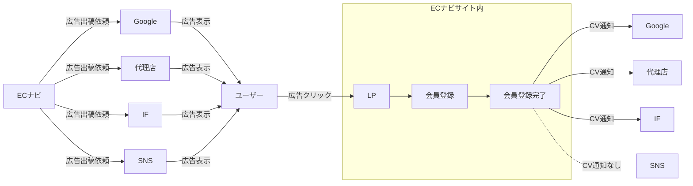
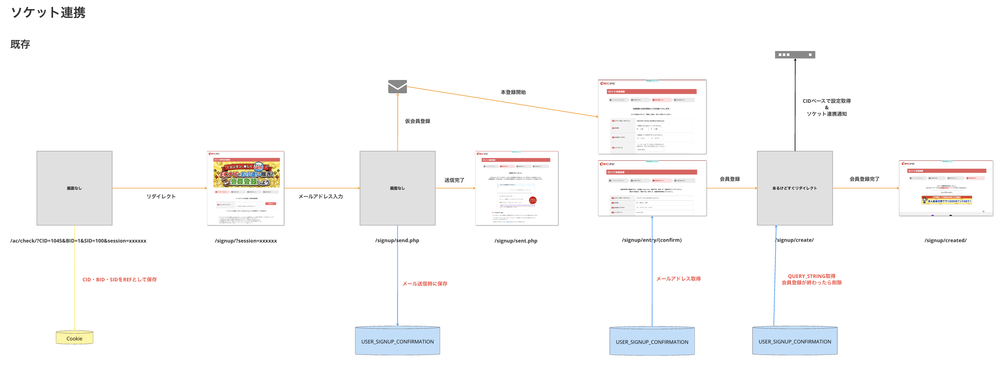
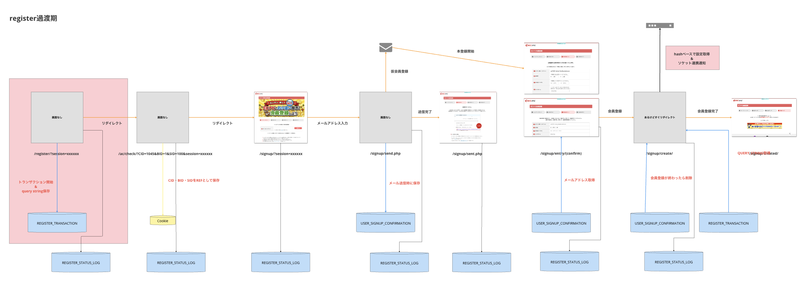
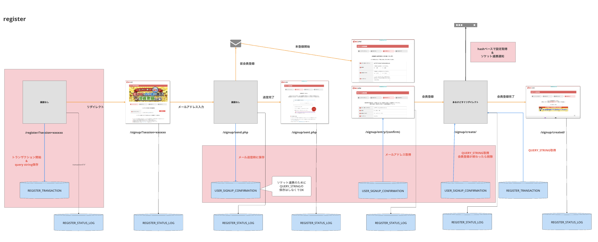
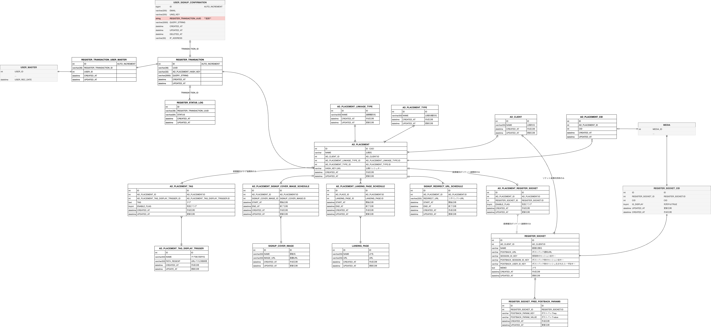
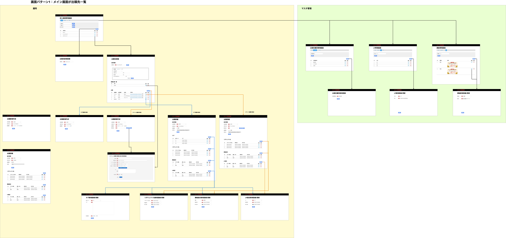
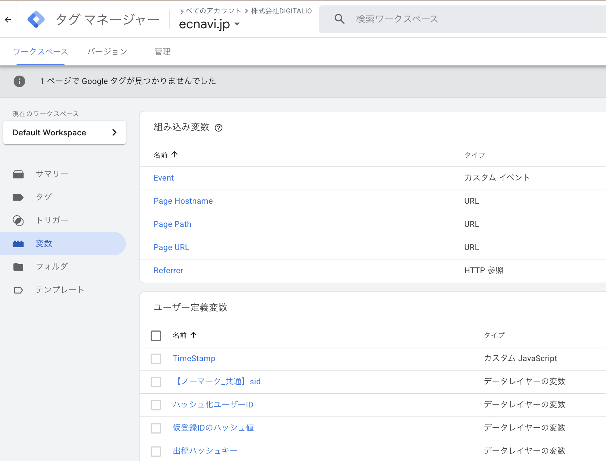
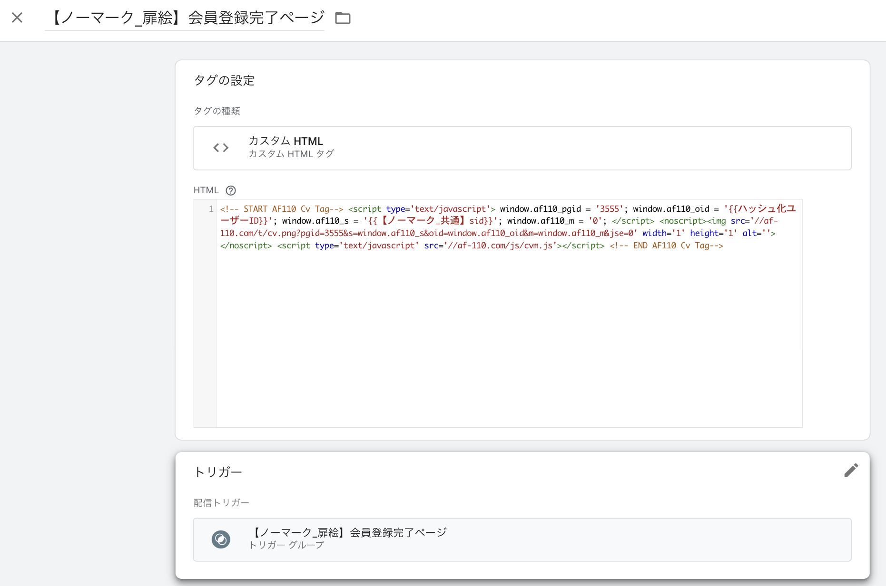

# 新規ユーザー流入システムを0から作り変えた話

## 執筆者
- 評価対象者、所属、グレード
  - 小林彩花(あやか) 
  - 株式会社DIGITALIO メディア事業本部 TechUnit Affiliateチーム
  - E2
- 執筆時期
  - 2025/04
 
## 前回の技術力評価会資料

https://github.com/voyagegroup/tech-assessment_2024/blob/main/2024-1st-half/digitalio_ayaka/README.md?plain=1

## 概要

- ECナビの新規ユーザー流入の箇所のシステムは既にレガシーになっており、特殊ルールや謎の変数が存在し、運用ミスを招くようなものに成り果てていた。
- ビジネスにおいて経路毎の施策や、調査を依頼されても、知見がある人がいない上に読みづらいコード、存在しないログなどから皆を困らせていた。
- 一念発起して新規ユーザー流入システムを丸ごと作り変えて、現在の運用に沿った且つ管理しやすい体系を整えた。

## 用語

用語| 意味
---|---
ECナビ|https://ecnavi.jp/<br>アフィリエイトなどでポイントを貯めることが出来るサービス。<br>貯めたポイントはPeXへ交換し各種ギフト券などへ交換可能。<br>
広告出稿 | ECナビでは、新規ユーザーを獲得するために様々な媒体に広告出稿をしている。<br>出稿にあたって、CV = 会員登録完了 とし、広告出稿先に成果通知を送ったり、計測したりしている。
ソケット連携 | ECナビの広告出稿の繋こみ方法の一つ。<br>ECナビの会員登録が完了したら、サーバーサイドから連携先に成果通知をポストバックする方法。
タグ連携 | ECナビの広告出稿の繋こみ方法の一つ。<br>ECナビの会員登録が完了したら、会員完了ページに埋め込んだscriptなどで発火させて連携先に成果通知をポストバックする方法。
計測のみ | 純広告やアプリ出稿などは、数値の計測のみをしており、CV値をどこかに成果通知するようなことはしていない。例えば、アプリの出稿としてAppsFlyerを使っている。
CID | Client IDの略(言い伝えによる)。<br>どの経路からの会員登録かを識別するためのID。<br>広告出稿の連携先には、CID付き新規会員登録リンクを渡し、そこにユーザを遷移させてもらう。<br>ECナビでは特定のCIDの経路からの流入がどのくらい多いかを分析する際等に使用している。
新規ユーザー流入システム | ECナビのユーザー獲得するための周辺システムの総称として本記事では用いる。
商材マスタ | ECナビでは広告掲載をすることで売上をあげている。掲載している広告群の事を商材と呼称しており、商材のデータを扱うシステムのことを商材マスタと本記事では用いる。
TechUnit | [hitonowa組織図](https://hitonowa.work/carta/organization/team/1430)<br>メディア事業本部内のエンジニア全員が所属するUnit。各Unitに対してチームとして専属でついたりする。<br>当時筆者はAffiUnitにつき、Affiliateチームのリーダーを担当していた。
AffiUnit | ASPとのやり取りを始めとした掲載商材や成果管理を行うセールスチームと、新規会員登録やプロモーションを主に行うユーザーチームから成るUnit。


<details open><summary>広告出稿の流れ</summary>


※ IF = インフルエンサーのこと。ナビではIFと略されるのだ…

</details>

### 今回関わったメンバー
開発メンバー
  - (プロさん)(消えた)
  - 私
  - ぐり（小栗 大輝）
  - ふじ（藤井 渉）
- ディレクション
  - なみっくさん

※全員他業務と兼務していた。

## 期間

2024年4月中旬頃 〜 2025年1月末
実際の本格的な動き始めは6月頃
メンバーに動きがあったり等でふわっとしていた。

# 背景
- Affi unitはメディア事業本部内でも大きな売り上げを支えるUnitである。
- Unitが主に利用しているシステムを見てみると、10年近く前に作られたシステムを利用しており都度パッチ当ての改修を重ねてきて、対応するエンジニアのリソースコストが膨れてきていた。
- 該当システムの実装当時から時間が経ち、想定されていた目的やコンセプトから外れた利用のされ方や、調査やリカバリのしにくさなど散見され、インシデントの見える化をしたことによってより目立つようになってきた。
  - インシデントの見える化とは、DIGITALIOとしての取り組みで、インシデントが起きたらまずメディア事業本部_インシデント第一報告所に投げ、まとめdocsを書き再発防止を務める動きのことである。

# やったこと①
- AFFI_UNITに専属のチームとして始まってから、週に1度UNITの今の状況についてエンジニア達でむにゃる会を設けた。
- その際に、普段触るシステムが複雑でパッチを当ててしのいでいるような状況に追い込まれた結果、無駄に時間を消費してることが議論によくあがった。
- ビジネスサイドや、上司に相談して、AFFI_UNITで使うシステムを改善するPJとして発足する事を決定した。
- まずはAFFI_UNITで触るシステムを一覧に出して、そのなかで 新規ユーザー流入システムは商材マスタなどと比べて比較的手を出しやすいと判断した。


# 調査してわかった新規ユーザー流入システムの課題
- 運用面
  - [当日CID管理画面を見せる](https://ecnavi-admin.ecnavi.me/ad_effectiveness/cid/)
    - 社内ツールの構造が煩雑でわかりにくい。 
  - 運用負荷が高い。
    - 扉絵設定を夜なべして設定していた。
    - 出稿URLが謎。CIDを主に使っており、 BID, SID等は謎の変数になっていた。
        - 例) `https://ecnavi.jp/ac/check/?CID=1234&BID=1&SID=102`
            - BID, SIDは固定値で、システムの方でもSID=102に上書きするなどしていた。
        - CIDも利用ミスして全経路配信してしまうミス(CID=10000の場合の特殊ケース)などが相次いでいた。
  - トラッキング漏れによる、出稿先とのコミュニケーション負荷があった。
  	- 多分トラ漏れしてるんだよね、という声があった。
       - そもそもトラ漏れしてるかどうかが補足できなかった。
- システム面
  - 新規ユーザーの流入経路の計測が不十分(トラッキングが正確にできない)で、調査が困難だった。
  - システムの設計が古く、以下の影響を及ぼしていた。
    - 保守運用時に既存のロジックや構造が足かせとなり、改修や障害対応の際のリスクが高かった。
      - 新規ユーザーの流入に関連する新しい施策の実施や検証をするにも、まずは調査から入らなければならなかった。
    - 新たなビジネス要件や分析ニーズへの対応が困難になっていた。
      - 仕様が複雑で、把握している人が居ない状態だったので、都度調査していた。
          - CIDの桁数による特殊運用の存在（10000は全経路配信等）
          - クッキーの中身を引き回していろんなところで参照されてるので影響範囲が不明瞭
          - とかとか

ref:[DesignDoc](https://docs.google.com/document/d/1m-SbzxmFbmzsY-GUvASVCaCClp3aaUNRg5xqHvM4le4/edit?tab=t.0#bookmark=id.2nl6j4lnjdo9)

# 旧システムと、新基盤の会員登録フロー

## 旧システム
- 旧システムは、出稿毎にCIDを作成していた。
  - そのため同じ出稿先にどんな出稿が出てるかが把握しづらかった。※出稿名もルールなどはなく、人によって様々だった。
- cookieにCIDを焼いて、クエリパラメータで持ち回っていた。
  - これによって起こり得るデメリットは、以下の通り
    1.  セキュリティリスク  
    クエリパラメータはURLに露出するため、外部リンクを踏んだときなどにリファラに漏れるし、ブラウザ履歴やログにも残る。  
    仮に出稿先がユーザーを特定可能なデータ等をくっつけて送ってきた場合には、意図しない情報漏洩の原因になりうる。  
    2. 運用が複雑化する  
    クエリに埋め込む→Cookieに焼く→再利用 という流れを毎回やる必要がある。  
    実装側のコードが散らばりがちで、仕様変更が入ると保守コストが高い。  
    Cookieの有効期限やドメインスコープの管理を誤ると想定通りに動かない。  
    クッキーサイズ制限等に注意が必要。

### 流れ
<kbd></kbd>

<details><summary>USER_SIGNUP_CONFIRMATIONのDDL</summary>

```sql
(ecnavi)> show create table USER_SIGNUP_CONFIRMATION;
+--------------------------+------------------------------------------------------------------------------------------------------------------------------------------------------------------------------------------------------------------------------------------------------------------------------------------------------------------------------------------------------------------------------------------------------------------------------------------------------------------------------------------------------------------------------------------------------------------------------------------------------------------------------------------------------------------------------------------------------------------------------------------------------------------------------------------------------------------------------------------------------------------------------------------------------------------------------------------------------------------------------+
| Table                    | Create Table                                                                                                                                                                                                                                                                                                                                                                                                                                                                                                                                                                                                                                                                                                                                                                                                                                                                                                                                                                 |
+--------------------------+------------------------------------------------------------------------------------------------------------------------------------------------------------------------------------------------------------------------------------------------------------------------------------------------------------------------------------------------------------------------------------------------------------------------------------------------------------------------------------------------------------------------------------------------------------------------------------------------------------------------------------------------------------------------------------------------------------------------------------------------------------------------------------------------------------------------------------------------------------------------------------------------------------------------------------------------------------------------------+
| USER_SIGNUP_CONFIRMATION | CREATE TABLE `USER_SIGNUP_CONFIRMATION` (
  `ID` bigint NOT NULL AUTO_INCREMENT,
  `EMAIL` varchar(255) COLLATE utf8mb4_general_ci DEFAULT NULL,
  `UNIQ_KEY` varchar(255) COLLATE utf8mb4_general_ci DEFAULT NULL,
  `REGISTER_TRANSACTION_UUID` varchar(36) COLLATE utf8mb4_general_ci DEFAULT NULL COMMENT 'REGISTER_TRANSACTION.UUID. ????????UUID',
  `QUERY_STRING` varchar(2000) COLLATE utf8mb4_general_ci DEFAULT NULL,
  `CREATED_AT` datetime DEFAULT NULL,
  `UPDATED_AT` datetime DEFAULT NULL,
  `DELETED_AT` datetime DEFAULT NULL,
  `IP_ADDRESS` varchar(50) COLLATE utf8mb4_general_ci DEFAULT NULL,
  PRIMARY KEY (`ID`),
  UNIQUE KEY `USER_SIGNUP_CONFIRMATION_UK1` (`UNIQ_KEY`),
  KEY `USER_SIGNUP_CONFIRMATION_IDX1` (`EMAIL`),
  KEY `USER_SIGNUP_CONFIRMATION_IDX2` (`IP_ADDRESS`),
  KEY `USER_SIGNUP_CONFIRMATION_IDX3` (`CREATED_AT`)
) ENGINE=InnoDB AUTO_INCREMENT=49747 DEFAULT CHARSET=utf8mb4 COLLATE=utf8mb4_general_ci COMMENT='???????' |
+--------------------------+------------------------------------------------------------------------------------------------------------------------------------------------------------------------------------------------------------------------------------------------------------------------------------------------------------------------------------------------------------------------------------------------------------------------------------------------------------------------------------------------------------------------------------------------------------------------------------------------------------------------------------------------------------------------------------------------------------------------------------------------------------------------------------------------------------------------------------------------------------------------------------------------------------------------------------------------------------------------------+
1 row in set (0.00 sec)
```
</details>

## 新基盤の流れ

- cookieに焼くのは、transaction.uuid(DBのtransactionとは別物)だけにした。
- また、ユーザーがブラウザを変えたり、クッキーがクリアされたりしても、メールに含まれるUNIQ_KEYからサーバー側でデータを復元できるように設計している。  
  つまり、「一時的にステートを失っても回復できる」＝ 状態が一部失われてもシステム全体が破綻しないように工夫された構成といえる。
※利点は後述

<kbd></kbd>

> [!TIP]  
> [REGISTER_STATUS_LOGに保存するタイミング&ステータス](https://github.com/voyagegroup/ecnavi/blob/7c3d6239799d300bfa671e4db76b342a60a59d29/sites/ecnavi/src/Ecnavi/Ecnavi/Register/RegisterStatusEnum.php)

## 過渡期
<kbd><kbd>

# PJとしてやったこと

- データ計測基盤の改善
   - 出稿を出稿先でまとめる。
   - 今まで出稿の名前を、「出稿先_instagram①」のようにつけていたが、出稿先を分けて登録できるようにした。
   - 出稿先に紐づけて出稿を作る事ができるようになったので、現状の運用を反映した構造になった。
- Transactionの概念を誕生させた
  - transaction.uuidというランダムな文字列を発番し、キーとしてユーザーの進行度合いを計測できるようにした。
  - 外部から渡ってくるクエリパラメータはDBに即保存するようにした。
  - これらによって以下の恩恵を得られると考えている。
    1. セキュリティ向上  
    cookieにはユーザーを識別可能な情報やセンシティブなデータを一切保存しないため、安全性が高い。  
    　　=> パラメータでデータを持ち回らないことで、リファラやログ経由の情報漏洩リスクを回避できる。  
    transaction.uuid自体はランダムなトークンなので、盗まれても悪用しにくい。  
    更に、1日の時間制限もあるので、データの圧迫もしないし、どの段階まで到達しているのかといった状態不明のCS対応などにも役立つ。  
    2. データの整合性とログの担保  
    入力途中のデータや未確定の状態も即座にDBに保存されるため、途中離脱やエラーがあっても原因特定やユーザー追跡がしやすい。  
    施策の分析にも使える。（例：入力完了率や離脱ポイント分析）  
    3. 状態を一元管理しやすく、ユーザ操作の再現性やサポート性が高い  
    transaction.uuidをキーとして、トランザクション単位でデータの一貫性を保てる。
    画面ステップや状態の進行度をすべてこのIDに紐付けて追えるため、バリデーションやステータス管理がしやすくなる。
    万が一の不具合や問い合わせが発生しても、transaction.uuidをもとにその時の状態・入力内容を再現できる。
- 外部連携の効率化
   運用さんだけで出稿作業をできる状態は保った。
   - タグ連携はGTMを導入する
       - CIDの特別ルールのようなものがなくなった。
       - GTMとECナビ管理画面どちらもで運用していたところ、GTM一本で管理できるようになった。
- UI/UXの改善
   - 管理画面において
       - 扉絵やLPなども管理できるようになった。
       - 時間設定ができるようになった為、夜中に扉絵を設定する必要がなくなった。
   - 出稿毎に詳細な設定がされており、直感的に分かりやすいページ構成になっている。

## テーブル群
https://app.diagrams.net/#G1vFFsTtEWcVjG9vPiodbRzMzxEad7YBHk#%7B%22pageId%22%3A%227qcaUk9GcKP8TOoVF2PB%22%7D
<kbd></kbd>

※全体像を把握してもらう為、全員が作った最終形態をここには載せる。
## 管理画面
<kbd></kbd>

## GAM
<kbd></kbd>
<kbd></kbd>


# その中で私がやったもの②

- そもそもつらくない？といってPJ化するに至るまでパワーで持っていった。
    - 既存のシステムに足を引っ張られまくってる現状に切り込んで、ビジネスにもエンジニアにも合意形成を取った。
- ディレクション
    - どのように進めるかの意思決定をし、初速を巻き取った。
    - タスクの細分化をしてスケジュールを引き、1月末に全機能稼働できる状態を作れた。
- [[入会経路システム基盤改善] ソケット連携の出し分け](https://github.com/voyagegroup/ecnavi/issues/20085)
   - 前回の評価階記事に詳しく書かれているが、ソケット連携の設定を運用者だけに完結できるようにしていた。
   - そこを今回のシステムでも使えるように組み込めたので、やっておいてよかった！

## PJとしての成果
- [#pm_affi_基盤改善](https://cartaholdings.slack.com/archives/C07D8PB1PF0)に差分がどのくらいあるかをRedashで監視できるようにメンバーが設定をしてくれた。
    - それを毎日確認する限り、殆ど同値で測れていることがわかった。
    - 差分がある場合は大体新基盤のほうが1~2カウント多い程度。
    - 状況を鑑みるに、旧システムではトラ漏れしてしまったものが、今のシステムでは捕捉できているのではないかと考えている。
    - 結果、トラ漏れはしていなさそう。これにより、これまでも、大きな事故はなかったと言えそう。
- 夜な夜な運用さんが0時に扉絵設定を変える作業などがなくなった。スタンディングオベーション。
- 出稿先毎にまとめたおかげで、出稿の管理がしやすくなった。どこの出稿先に、どの面で広告を出しているかなどが追いやすくなっている。
- どこで離脱したかが分かるので、分析もしやすいし、施策も打ちやすくなった。

## 今後の展望
- 未だビジネスサイドによる出稿の移行期間中であり、CIDの完全葬りに持っていける状態には至っていない。
- とは言え、移行完了は6月という期限を決めて運用サイドには合意を取っている。
- システム的なCIDの完全葬りも5月から始め、1~2ヶ月を目安にやり遂げる予定である。
- メンバーは引き続きguriと私。

## 付録
- [Affiliate基盤改善について＆キックオフ](https://docs.google.com/document/d/1Pi9bW7AZw3oIugQPUwSL82C9KyCJtmxnHfdsHMJwVaM/edit?tab=t.0#heading=h.2mu0ux26oult)
- [Affiliate基盤改善議事録](https://docs.google.com/document/d/1TRBTpbG_rVi75XwP54S8SRpyH8Xjp7HRhv0Dp1YHTuo/edit?tab=t.0)
- [Affiliate基盤改善_対象システムと課題まとめ](https://docs.google.com/spreadsheets/d/1Uh8rFAVNdZavTh9N8nFcsNHEIDfC8IyEClo-5z16lfM/edit?gid=0#gid=0)
- 既存システム図
  - [ソケット連携＆タグ連携](https://cacoo.com/diagrams/b6qqZ8zOncz5akZs/A815F)
- [issue](https://github.com/voyagegroup/ecnavi/issues/19262)
- [スケジュール](https://ecnstaff.backlog.jp/gantt/AFFI_ENG?span=6&scale=days&startDate=2024%2F06%2F01&categoryId=1074485553)
  - [spreadsheetのURL](https://docs.google.com/spreadsheets/d/1f5A8l4SNtXOUoELbUsoEKHZRHD6IIQuBsGBYQkF_bwU/edit?gid=1287345026#gid=1287345026) 
- [DesignDoc](https://docs.google.com/document/d/1m-SbzxmFbmzsY-GUvASVCaCClp3aaUNRg5xqHvM4le4/edit#heading=h.jkifuegns9j2)
- [シン・会員流入経路管理システム](https://app.diagrams.net/#G1HaWpMrHsxIHOJboWmfTkl0omxXyyANTx#%7B%22pageId%22%3A%22NLN4HMOZNFzHYUfSgU8m%22%7D)
- ER図: [draw.io](https://app.diagrams.net/#G1vFFsTtEWcVjG9vPiodbRzMzxEad7YBHk#%7B%22pageId%22%3A%22R2lEEEUBdFMjLlhIrx00%22%7D)
- [新規流入基盤改善KPT](https://docs.google.com/spreadsheets/d/1rteJOS8WqOHLYj7jHGFdeI_FY0nYM2MPsIdJV726CSM/edit?gid=0#gid=0)
